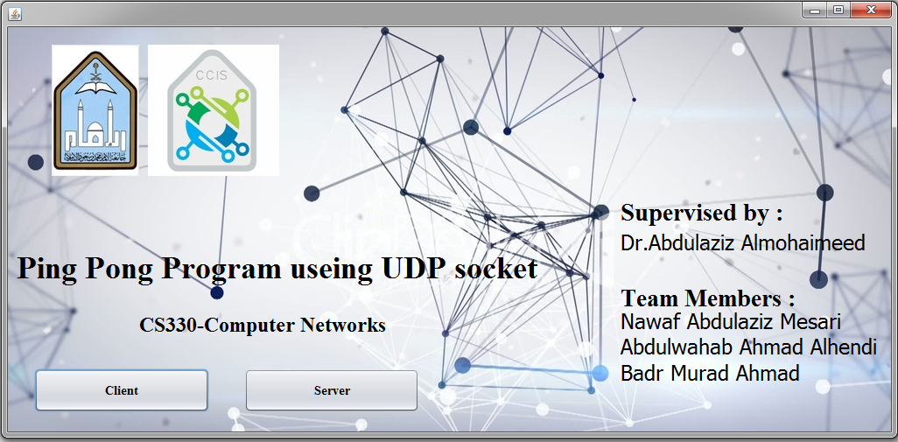

# Ping_pong_project
 Ping and Pong operation is defined as a communication between network devices allowing each host to know if the opposite end host is still present and available. The main feature of the ping and pong program is to know the reachability between two hosts over the internet network. In a ping pong communication, the Ping is the transmission of the packet from sender side to the opposite computer and the Pong is the response from the receiver side.
Reachability is determined by computing Round Trip Time (RTT) for the packets that sent from the originating host to a destination and back.

